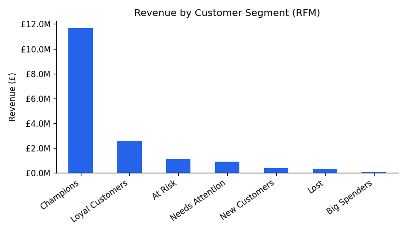
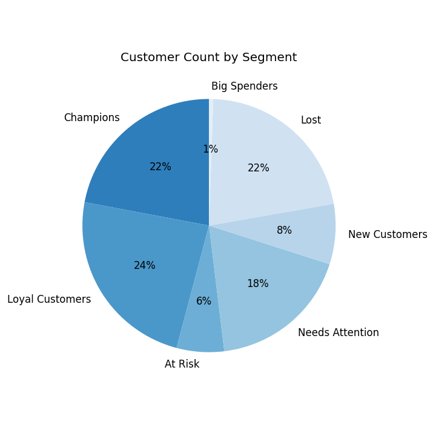
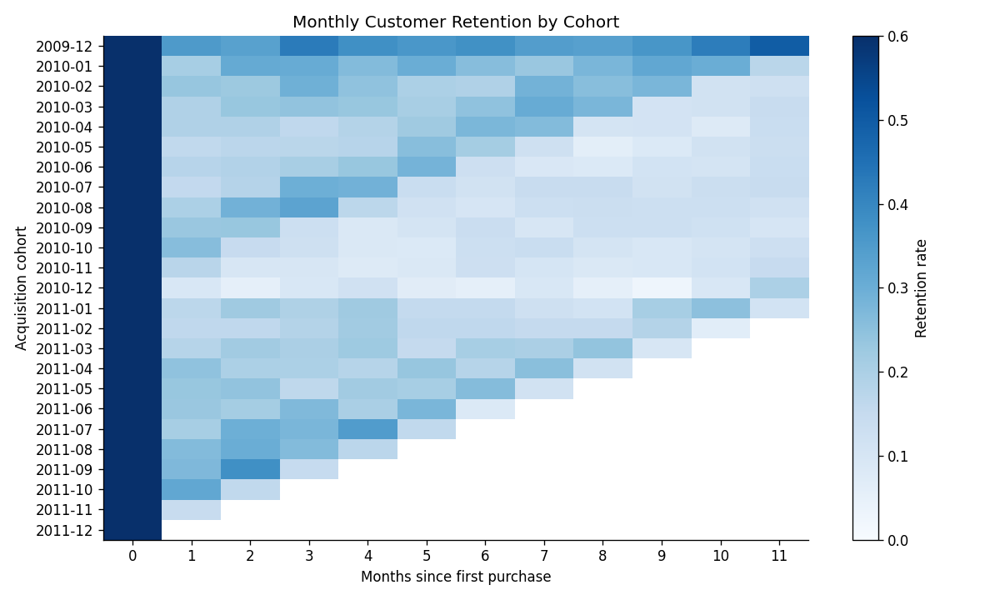
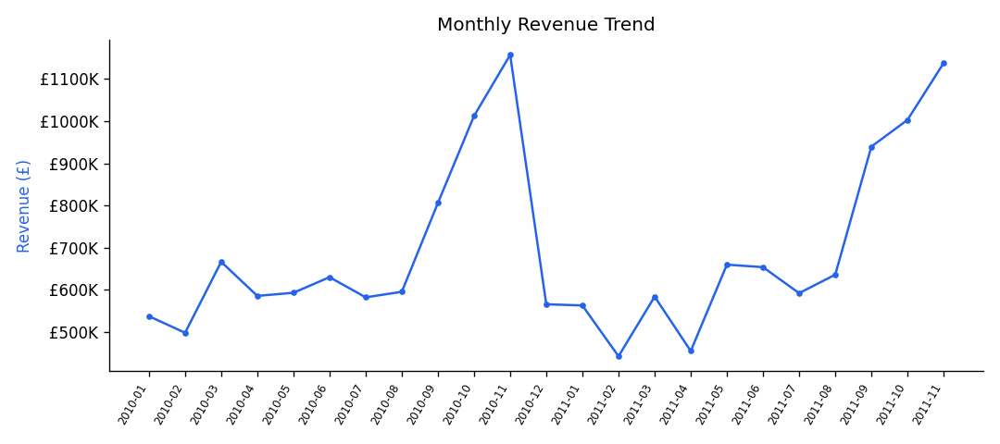
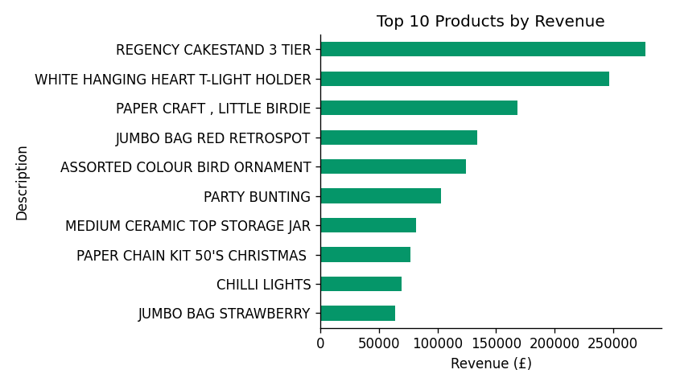
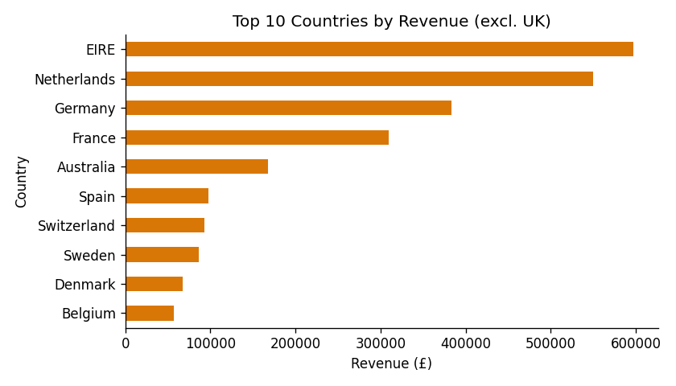
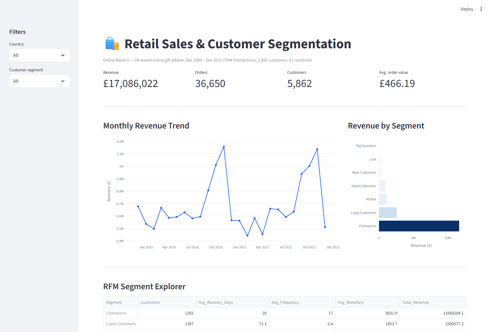
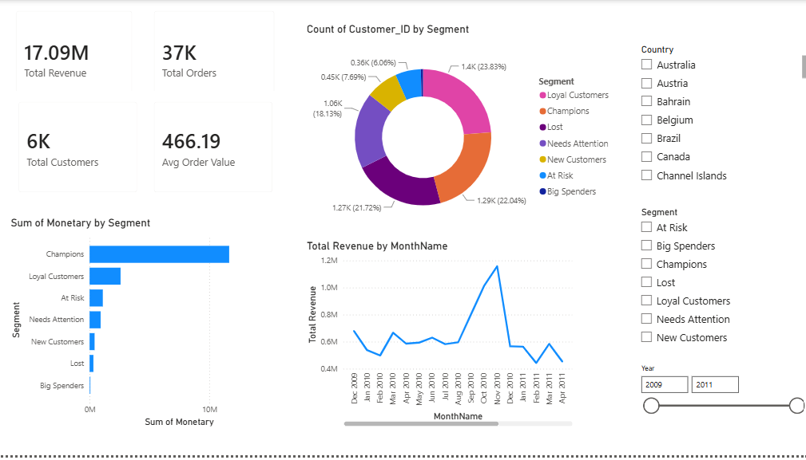
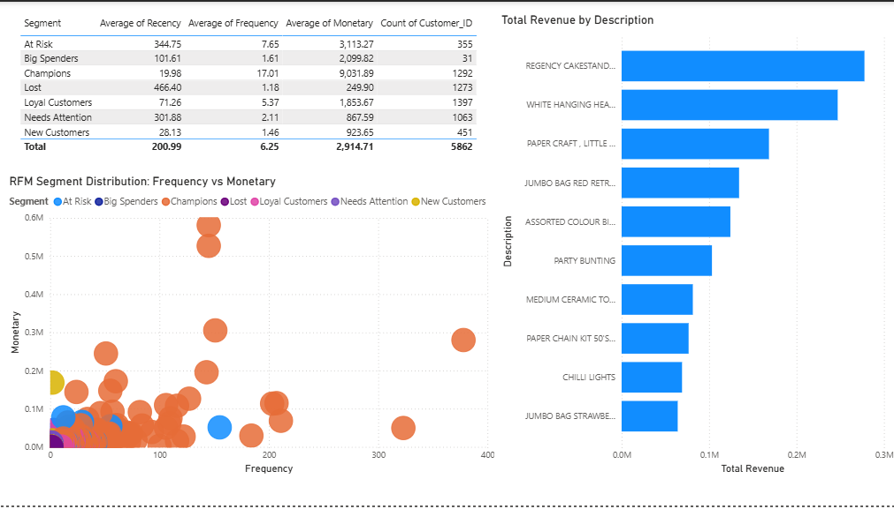

# Retail Sales & Customer Segmentation Analytics

**Business analytics case study** — RFM customer segmentation, sales trend analysis, and cohort retention for a UK-based online gift retailer, built on 794K real transactions.

## TL;DR

- **22% of customers ("Champions") generate 68% of total revenue** — a textbook Pareto pattern that should drive where retention budget gets spent.
- **First-month customer retention is only ~21%**, and it barely improves by month 3 (~22%) — most churn happens immediately after the first purchase, not gradually. That points to an onboarding/second-purchase problem, not a loyalty problem.
- Revenue is strongly **seasonal**, peaking in November (£1.16M) ahead of Christmas — a UK gift retailer, as expected — which matters for inventory and cash-flow planning.
- Segment-level view turns "grow revenue" into a concrete plan: protect the 22% of Champions, convert the 24% "Loyal Customers" segment upward, and treat the 22% "Lost" segment as a separate win-back campaign rather than more generic marketing spend.



## Business Problem

A retailer with thousands of customers and millions in revenue can't treat every customer the same way — the marketing budget spent retaining a customer who spends £5,000/year should look nothing like the budget spent on someone who bought once and never returned. This project answers three questions a business/marketing analytics role is actually asked:

1. **Who are our customers, and which ones matter most?** (RFM segmentation)
2. **Is the business growing, and when?** (monthly sales trend)
3. **Are we keeping customers, and where do we lose them?** (cohort retention)

## Data

[UCI Online Retail II](https://archive.ics.uci.edu/dataset/502/online+retail+ii) — real invoice-level transactions from a UK-based online gift retailer, 1 Dec 2009 – 9 Dec 2011.

| | |
|---|---|
| Raw rows | 1,067,371 |
| Clean rows (after removing cancellations-only noise, missing customer IDs, non-product fee codes, bad quantities/prices) | 794,667 |
| Customers | 5,895 |
| Countries | 41 |
| Total revenue (excl. cancellations) | £17,086,022 |

Cleaning logic: [`src/clean_data.py`](src/clean_data.py). Neither the raw data nor the cleaned 85MB transaction-level CSV is committed to this repo (see `data/raw/` and `.gitignore`) — both regenerate in under a minute by re-downloading the raw file (link above) and running `python src/clean_data.py`. The smaller derived result tables (RFM segments, monthly trend, cohort retention, top products/countries) *are* committed under `data/processed/`, since those are what the dashboard and README figures are actually built from.

## Methodology

**RFM segmentation** — each customer scored 1-5 on Recency (days since last purchase), Frequency (distinct orders), and Monetary value (total spend), using quintile binning. Scores combine into seven business-readable segments (Champions, Loyal Customers, At Risk, Lost, etc.) rather than raw 1-125 RFM codes, so the output is something a marketing team can act on directly. See [`src/analysis.py`](src/analysis.py).

**Cohort retention** — customers grouped by the calendar month of their first purchase, then tracked forward to see what fraction of each cohort is still buying in each subsequent month.

**Sales trend** — monthly revenue/orders/customers, with the partial first and last calendar months excluded so the trend isn't distorted by incomplete data at the edges of the date range.

## Key Findings

### 1. Revenue is concentrated in a small, identifiable group of customers



| Segment | Customers | % of customers | Revenue | % of revenue |
|---|---|---|---|---|
| Champions | 1,292 | 22.0% | £11,669,204 | 68.3% |
| Loyal Customers | 1,397 | 23.8% | £2,589,577 | 15.2% |
| At Risk | 355 | 6.1% | £1,105,211 | 6.5% |
| Needs Attention | 1,063 | 18.1% | £922,244 | 5.4% |
| New Customers | 451 | 7.7% | £416,565 | 2.4% |
| Lost | 1,273 | 21.7% | £318,126 | 1.9% |
| Big Spenders | 31 | 0.5% | £65,094 | 0.4% |

**Read on this**: the "Lost" segment is 21.7% of the customer base but only 1.9% of revenue — win-back campaigns aimed there have a low ceiling. The better lever is the "Loyal Customers" and "Needs Attention" segments (nearly 42% of customers, 20.6% of revenue combined) — moving even a fraction of these into Champions has a much larger payoff than chasing lapsed one-time buyers.

### 2. Customer retention drops off immediately, not gradually



Average retention falls from 100% (month 0, the purchase itself) to **~21% by month 1**, then stays roughly flat (~22% by month 3) rather than continuing to decay. That flat shape after the initial drop is the important part: it means the customers who make it past month 1 tend to stick around, so **the highest-leverage intervention is a second-purchase nudge in the first 30 days**, not a generic long-term loyalty programme.

### 3. Revenue is seasonal, peaking ahead of Christmas



Revenue peaks in November each year (£1.16M in Nov 2010) ahead of the Christmas gift-buying season, consistent with the retailer's product mix (gift and decorative items — see top products below). This matters directly for inventory planning and staffing, not just reporting.

### 4. Product and geographic concentration




The top single product ("Regency Cakestand 3 Tier") generated £277,656 in revenue on its own. Outside the UK, the Netherlands, Germany, and EIRE (Ireland) are the largest markets — relevant if the business were to prioritise international marketing spend.

## Interactive Dashboard (Python / Streamlit)



Filter by country and customer segment, explore KPIs, the RFM scatter plot, and top products/countries live.

```bash
pip install -r requirements.txt
streamlit run dashboard/app.py
```

## Power BI Dashboard

A second, parallel dashboard was also built in Power BI Desktop to demonstrate BI-tool proficiency alongside the Python stack.




See [`powerbi/`](powerbi/) for the data model, DAX measures, and how to reproduce it.

## Tech Stack

Python (pandas, NumPy) · Matplotlib · Plotly · Streamlit · Power BI

## Repository Structure

```
retail-sales-customer-segmentation/
├── README.md
├── LICENSE                MIT
├── requirements.txt
├── data/
│   ├── raw/                (gitignored — see Data section for download link)
│   └── processed/          cleaned transactions + all result tables (CSV)
├── src/
│   ├── clean_data.py       raw -> clean transactions
│   └── analysis.py         RFM, cohort retention, trend, top products
├── dashboard/
│   └── app.py               Streamlit interactive dashboard
├── powerbi/                 .pbix build spec, DAX measures, screenshots
├── figures/                  chart PNGs used in this README
└── tests/                    sanity-check tests for the cleaning/analysis pipeline
```

## How to Reproduce

```bash
git clone https://github.com/nahid-hasan-lipu/retail-sales-customer-segmentation.git
cd retail-sales-customer-segmentation
pip install -r requirements.txt

# Download data/raw/online_retail_II.xlsx from the UCI link above, then:
python src/clean_data.py
python src/analysis.py
streamlit run dashboard/app.py
```

## Author

**Nahid Hasan Lipu** — [GitHub](https://github.com/nahid-hasan-lipu) · [LinkedIn](https://www.linkedin.com/in/nahid-hasan-lipu-922447355/)
